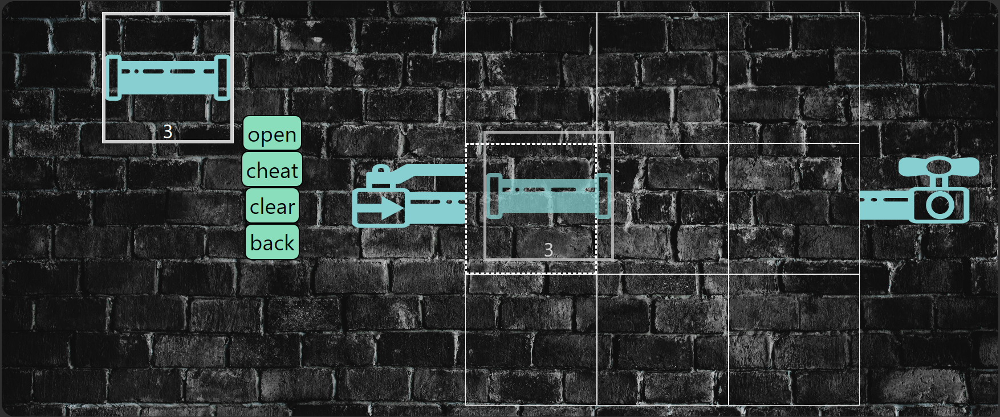

<html>
   <head>

   </head>
   <body>
      <header>
         
         <h1>PlumberMan game </h1>
         
In this game you need to correctly assemble the plumbing from the source to the consumer.The game has 5 easy and 5 difficult levels. On difficult levels, you will have to build a route to two consumers. 
         <article>
            <h2>Win conditions</h2>
            <ul>
               <li>Build a pipeline from the source to all consumers.</li>
               <li>Eliminate pipeline leaks.</li>
               <li>Open the tap</li>
            </ul>      
         </article>
      </header>
     
   </body>
</html>
